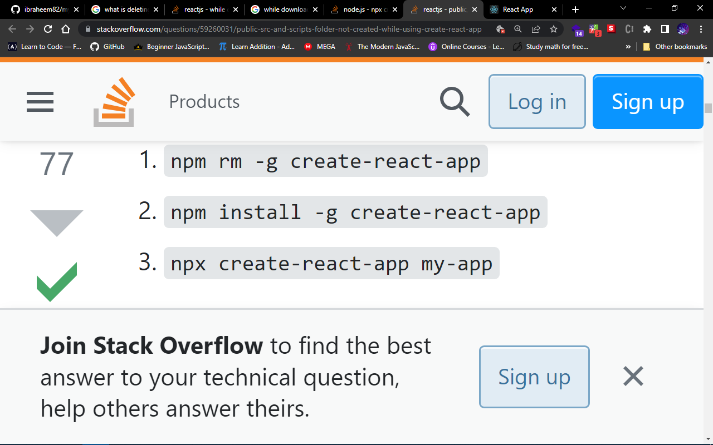

# Heading 1
## Heading 2
### Heading 3
#### Heading 4
##### Heading 5
###### Heading 6


<!-- Italics -->
My name is *ibraheem*
this is _omikunle_

<!-- Strong -->
**Strong** in git

__ibraheem__

<!-- StrickThrough -->
~~stricking~~ line

<!-- Horizontal rule -->

---
___

<!-- Blockquote -->
> This is our to write a blockquote

<!-- Links -->
[ibraheem](ibraheem82@gmail.com)
<!-- Title over link -->
[ibraheem](ibraheem82@gmail.com "ibraheem")

<!-- UL -->
* item 1
* item 2
* item 3
* item 4
* item 5
* item 6
    * Nested Item 1
    * Nested Item 2
    * Nested Item 3
    * Nested Item 4

<!-- OL -->

1. Item 1
2. Item 2
1. Item 3
1. Item 4
1. Item 5
1. Item 6

<!-- Inline code block -->

`<h1>Ibraheem</h1>`

<!-- Images -->



<!-- ! Github markdown -->

<!-- * Code Blocks -->
```js
npm install astro
🚀 --save
```

```py
npm install astro
🚀 --save
```

```javascript
function add(num1, num2) {
    return num1 + num2;
}
```


```python
def __str__
```

<!-- * Table -->

| Name                  | Email                       |
| --------              | --------                    |
| Ibraheem Omikunle     | ibraheemomikunle82@gmail.com|
| Ibraheem Omikunle     | ibraheemomikunle82@gmail.com|
| Ibraheem Omikunle     | ibraheemomikunle82@gmail.com|


<!-- Task Lists -->
* [x] Task 1
* [x] Task 2
* []  Task 3
* [x] Task 4
